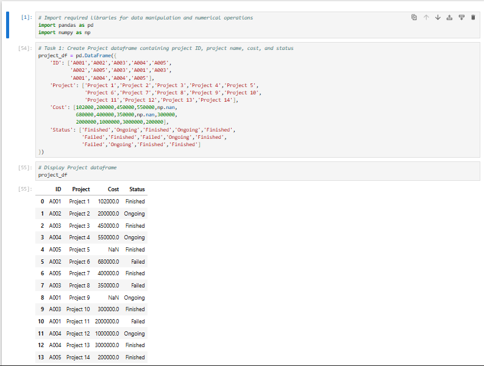

# 📊 Project Management Data Analysis (Python Capstone)

## 📌 Project Overview
This project focuses on analyzing project management data using Python. The objective is to clean, merge, and analyze structured datasets to generate meaningful business insights. The project demonstrates practical data manipulation techniques used in real-world business analytics scenarios.

---

## 🎯 Objectives
- Perform data cleaning and handle missing values  
- Apply statistical techniques for cost imputation  
- Merge multiple datasets using primary keys  
- Conduct group-wise aggregation and cost analysis  
- Generate structured insights from consolidated data  

---

## 🛠️ Tech Stack
- Python  
- Pandas  
- NumPy  
- Jupyter Notebook  

---

## 📂 Dataset Description

### 1️⃣ Project Dataset
- Project ID  
- Project Name  
- Cost  
- Status  

### 2️⃣ Employee Dataset
- Employee ID  
- Name  
- Gender  
- City  
- Age  

### 3️⃣ Designation Dataset
- Employee ID  
- Designation  
- Level  

---

## 🔎 Key Operations Performed
- Detection and treatment of missing values  
- Expanding mean technique for replacing missing project cost  
- Data merging using `pd.merge()`  
- Aggregation using `groupby()`  
- Employee-level total project cost calculation  
- Structured final dataset creation  

## 📸 Project Workflow & Key Outputs

### 1️⃣ Initial Project DataFrame  
Creation of structured dataset with identified missing cost values.  

### 2️⃣ Missing Value Imputation  
Replacement of missing project costs using expanding mean technique.  

### 3️⃣ Feature Engineering  
Splitting full name into first and last name for structured data processing.  

### 4️⃣ Final Merged Dataset  
Integration of project, employee, and designation datasets using left joins.  

### 5️⃣ Business Rule Implementation  
Bonus calculation applied to employees with completed projects.  

### 6️⃣ Final Cost Aggregation  
Total project cost calculated per employee using groupby aggregation.  

- Missing project cost values were handled using statistical imputation  
- Data merging enabled integrated employee-project analysis  
- Group-wise aggregation provided visibility into cost allocation  
- Structured data processing improves business decision-making in project environments  
